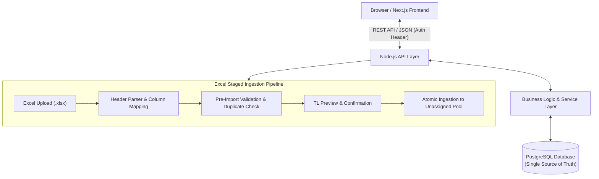

# CRM – Lead Management & Sales Distribution Platform
## Software Requirements Specification (SRS) & Developer Implementation Guide

---

### **Document Overview**
| Attribute | Detail |
| :--- | :--- |
| **Document** | CRM Project Requirements Specification (Developer Handoff) |
| **Status** | Approved Baseline for Development |
| **Initial Roles** | Team Leader (TL), Sales Executive |
| **Frontend** | Next.js (TypeScript, Tailwind CSS recommended) |
| **Backend** | Node.js (Authoritative REST API / Service Layer) |
| **Primary Data Source** | Excel lead files (`.xlsx` / `.xls` / `.csv`) |
| **System of Record** | Relational CRM Database (PostgreSQL recommended) |

> **Purpose:** Practical functional and technical baseline for the engineering team. Excel serves strictly as an import/export mechanism; the database is the authoritative single source of truth.

---

## 1. Executive Summary & Core Objectives

The platform provides a centralized, auditable lead intake and distribution system:
1. **Excel Intake:** Import bulk lead lists with schema validation, header mapping, previewing, and duplicate detection.
2. **Sales Distribution:** Empower Team Leaders to distribute leads across executives (Equal, Fixed, Manual, Bulk) and dynamically reassign or recall leads while preserving history.
3. **Executive Work Queue:** Provide Sales Executives a focused dashboard showing only their assigned leads, upcoming follow-ups, and interaction tools.
4. **Lifecycle Tracking:** Maintain full chronological timelines (notes, calls, meetings, status changes, assignments).
5. **Analytics & Performance:** Deliver TL dashboards with team metrics, conversion analytics, and employee performance tracking.
6. **Data Integrity & Security:** Enforce backend authorization, database transactions for atomic batch operations, immutable activity logs, and soft deletes.

---

## 2. Technology Stack & High-Level Architecture

### Technology Stack
* **Frontend:** Next.js (App Router), React, Server & Client Components, Responsive UI.
* **Backend:** Node.js authoritative REST API (Express / Fastify / Next.js Route Handlers).
* **Communication:** REST / JSON with typed contracts.
* **Database:** Relational DB (PostgreSQL recommended with Prisma or Drizzle ORM).
* **Authentication:** JWT / Secure HTTP-only cookies with session revocation support.
* **Excel Engine:** Fast Excel parser/generator library (e.g., `xlsx` / `exceljs`).

### Architecture Data Flow


> **Critical Rule:** Next.js UI components handle presentation and state display only. All validation, permissions, and business rules must be verified in backend services. Browser clients must never access the database directly.

---

## 3. Developer Implementation Checklist (Phases 1–7)

### Phase 1: Project Setup & Authentication
- [ ] Initialize repository structure (Next.js frontend + Node.js backend / typed monorepo).
- [ ] Implement database connection, migrations, and ORM setup.
- [ ] Implement authentication (Login, Logout, Session check `/api/auth/me`).
- [ ] Implement Role-Based Access Control (RBAC) middleware for **Team Leader** and **Sales Executive**.
- [ ] Seed database with initial roles, admin/TL user, and sample sales executives.

### Phase 2: Lead Model & Excel Import Engine
- [ ] Define `Lead`, `ImportBatch`, and `ImportError` database models.
- [ ] Implement Excel parser supporting `.xlsx`, `.xls`, and `.csv`.
- [ ] Implement column mapping interface with automatic alias detection.
- [ ] Implement row-level validation (required fields, valid phone/email formatting).
- [ ] Build duplicate detection logic (checking existing DB records by mobile number and email).
- [ ] Implement preview screen displaying valid, duplicate, and failed row counts before committing.
- [ ] Save batch metadata and row error logs upon import execution.

### Phase 3: TL Lead Pool, Distribution & Reassignment
- [ ] Build Unassigned Lead Pool and Assigned Leads view for Team Leaders.
- [ ] Implement Equal Distribution logic (split $N$ leads evenly among $M$ executives).
- [ ] Implement Fixed Distribution logic (assign explicit quantities per executive).
- [ ] Implement Manual Lead Assignment (select specific leads and assign).
- [ ] Implement Bulk Allocation with backend availability and transaction locking.
- [ ] Implement Reassignment (move leads between executives while recording `LeadAssignment` history).
- [ ] Implement Lead Recall (return selected leads back to unassigned pool).

### Phase 4: Sales Executive Dashboard & Detail Workflows
- [ ] Build Sales Executive Dashboard displaying assigned leads and work queue.
- [ ] Build Lead Detail Screen (customer details, requirements, notes, scheduled follow-up).
- [ ] Implement Status Transition workflow (enforcing permitted lifecycle states).
- [ ] Implement Interaction/Notes logging and Activity Timeline.
- [ ] Implement Follow-up Scheduler (Due Today, Upcoming, and Overdue tracking).
- [ ] Restrict view permissions so executives cannot access unassigned leads or other agents' data.

### Phase 5: TL Dashboard, Reports & Excel Export
- [ ] Build TL Dashboard with team KPIs, conversion funnels, and executive workload breakdown.
- [ ] Build multi-criteria search and filter engine (Lead ID, Name, Mobile, Status, Executive, Date, Source).
- [ ] Add server-side pagination and sorting.
- [ ] Build filtered Excel export engine preserving applied search parameters.

### Phase 6: Audit Logging, Notifications & Security Hardening
- [ ] Implement system-wide Audit Logger (capturing actor, action, previous/new values, timestamp).
- [ ] Implement in-app Notification triggers (lead assigned, reassigned, follow-up due/overdue).
- [ ] Enforce backend rate limiting, payload size limits, and sanitization.
- [ ] Write integration tests for distribution transactions and duplicate detection.

### Phase 7: Deployment, Backup & Production Readiness
- [ ] Set up production environment configuration and secrets management.
- [ ] Configure automated database backups and recovery drills.
- [ ] Set up error monitoring (e.g., Sentry) and health check endpoints.
- [ ] Finalize user documentation and developer API docs.

---

## 4. User Roles & Permissions Matrix

### 4.1 Admin (Superuser / System Administrator)
* Full system-wide governance, user management, and workspace administration.
* Create, update, deactivate, and assign roles (`ADMIN`, `TEAM_LEADER`, `SALES_EXECUTIVE`) to all users.
* Unrestricted access to lead inventory, unassigned intake pool, and all active/historical assignments across the entire organization.
* Execute or oversee all lead distribution strategies (Equal, Custom, Manual, Bulk) and rebalancing operations.
* Full access to security audit logs, system-wide analytics, conversion reports, and batch imports/exports.
* Authority to modify protected deals or system configuration with automated audit logging.

### 4.2 Team Leader (TL)
* View all team leads (both unassigned pool and assigned leads).
* Upload and parse Excel lead files; inspect import results and error batches.
* Distribute leads by employee and quantity (Equal, Fixed, Manual, Bulk).
* Reassign active leads or recall leads to unassigned pool.
* View employee performance metrics, follow-up compliance, and full lead histories.
* Access advanced search, filtering, bulk status updates, and Excel export.

### 4.3 Sales Executive
* View **strictly assigned leads**; no visibility into unassigned pool or colleagues' leads.
* Update permitted lead statuses throughout the sales lifecycle.
* Add qualitative notes, call summaries, and customer interaction logs.
* Schedule and complete follow-ups (track Due Today and Overdue).
* Mark leads as Won/Sold or Lost with reason notes.
* View personal dashboard metrics and work queue.
* **Prohibited:** Cannot reassign leads or assign leads to other employees in Release 1.

---

## 5. Lead Data Model & Database Relationships


### Core Entities
1. **`User`**: System identity (`id`, `name`, `email`, `passwordHash`, `roleId`, `isActive`, `createdAt`).
2. **`Role`**: Role definitions (`id`, `name`: `ADMIN` | `TEAM_LEADER` | `SALES_EXECUTIVE`).
3. **`Lead`**: Authoritative lead entity (`id`, `leadCode` e.g. `CRM-000001`, `customerName`, `mobile`, `alternateMobile`, `email`, `companyName`, `city`, `state`, `requirement`, `productService`, `budget`, `leadSource`, `priority`, `status`, `assignedToUserId`, `assignedAt`, `assignedByUserId`, `isDeleted`, `createdAt`, `updatedAt`).
4. **`LeadAssignment`**: Historical assignment ledger (`id`, `leadId`, `assignedToUserId`, `assignedByUserId`, `assignedAt`, `unassignedAt`, `reason`).
5. **`LeadActivity`**: Immutable chronological activity stream (`id`, `leadId`, `actorUserId`, `actionType`, `description`, `metadata`, `createdAt`).
6. **`LeadFollowUp`**: Follow-up tasks (`id`, `leadId`, `assignedToUserId`, `scheduledAt`, `type`, `status`: `PENDING` | `COMPLETED` | `MISSED`, `notes`, `completedAt`).
7. **`LeadStatusHistory`**: Status change logs (`id`, `leadId`, `oldStatus`, `newStatus`, `changedByUserId`, `notes`, `createdAt`).
8. **`LeadNote`**: Internal notes/comments (`id`, `leadId`, `authorUserId`, `content`, `createdAt`).
9. **`ImportBatch`**: Upload batch record (`id`, `fileName`, `uploadedByUserId`, `totalRows`, `importedCount`, `duplicateCount`, `failedCount`, `createdAt`).
10. **`ImportError`**: Row-level failure logs (`id`, `batchId`, `rowNumber`, `columnName`, `errorMessage`, `rawRowData`).
11. **`AuditLog`**: Security & administrative log (`id`, `actorUserId`, `action`, `entityType`, `entityId`, `oldValue`, `newValue`, `ipAddress`, `createdAt`).
12. **`Notification`**: User alerts (`id`, `recipientUserId`, `title`, `message`, `type`, `isRead`, `readAt`, `createdAt`).

### Relational Schema Diagram
```
User (1) ──────────< (M) Role
User (1) ──────────< (M) LeadAssignment
User (1) ──────────< (M) AuditLog
User (1) ──────────< (M) Notification
Lead (1) ──────────< (M) LeadAssignment (Historical log)
Lead (1) ──────────< (M) LeadActivity (Timeline)
Lead (1) ──────────< (M) LeadFollowUp
Lead (1) ──────────< (M) LeadStatusHistory
Lead (1) ──────────< (M) LeadNote
ImportBatch (1) ───< (M) ImportError
```

---

## 6. Excel Import Engine Specification


### 6.1 Column Mapping & Specifications
| Column Name | Required | Type / Format | Validation / Notes |
| :--- | :---: | :--- | :--- |
| **Lead ID** | No | String | Auto-generated (`CRM-XXXXXX`) if blank |
| **Customer Name** | **Yes** | String | Minimum 2 characters |
| **Mobile** | **Yes** | String (E.164/10-digit) | **Primary duplicate check key**; must be valid digits |
| **Alternate Mobile** | No | String | Optional alternate phone |
| **Email** | No | Email string | Valid email format if provided |
| **Company Name** | No | String | Business/employer name |
| **City / State** | No | String | Geographic location |
| **Requirement** | **Yes** | Text | Customer requirement description |
| **Product / Service**| No | String | Targeted offering |
| **Budget** | No | Decimal / Number | Expected deal value |
| **Lead Source** | No | String | e.g. Website, Facebook, Cold Call, Referral |
| **Priority** | No | Enum | `Low` / `Medium` / `High` / `Urgent` (Default: `Medium`) |
| **Remarks** | No | Text | Initial notes from spreadsheet |
| **Status** | No | Enum | Default `New` if missing or unmapped |

### 6.2 Pre-Import Validation & Duplicate Check
* **Required Check:** Fail row if `Customer Name`, `Mobile`, or `Requirement` are empty.
* **Duplicate Detection:** Primary match against existing database records using `Mobile` and secondarily `Email`.
* **Summary Feedback:** Display preview counts: `Total Rows`, `Valid (Ready to import)`, `Duplicates Detected`, `Failed Rows (Validation errors)`.
* **TL Action:** TL can choose to proceed with valid records, skip duplicates, or download an error log before finalizing import.


---

## 7. Lead Distribution & Assignment Engine

### Assignment Modes
1. **Equal Distribution:**
   $$\text{Leads Per Employee} = \lfloor \frac{N_{\text{total leads}}}{M_{\text{employees}}} \rfloor$$
   Remainder leads stay in the unassigned pool.
2. **Fixed Distribution:**
   Explicit allocation per selected employee (e.g., Emp A = 10, Emp B = 20, Emp C = 15).
3. **Manual Distribution:**
   TL selects individual checkboxes on the unassigned leads table and assigns to a target employee.
4. **Bulk Allocation:**
   TL chooses multiple team members and assigns quantities; backend verifies inventory inside a database transaction before committing.
5. **Reassignment:**
   Transfer leads between executives. Generates a new `LeadAssignment` record with prior holder marked with `unassignedAt`.
6. **Recall:**
   Revoke leads from an executive back to the unassigned pool (`assignedToUserId = NULL`).

> **Safety Rule:** All multi-lead distribution and reassignment operations must run within an ACID database transaction. If any step fails, the entire batch rolls back.

---

## 8. Lead Lifecycle & State Transitions

### Primary Pipeline
$$\text{New} \longrightarrow \text{Assigned} \longrightarrow \text{Contacted} \longrightarrow \text{Interested} \longrightarrow \text{Follow-up} \longrightarrow \text{Qualified} \longrightarrow \text{Proposal/Quotation} \longrightarrow \text{Negotiation} \longrightarrow \text{Won/Sold}$$

### Alternative & Terminal Outcomes
* **`Not Interested`**: Contact made, customer declined offering.
* **`No Response`**: Multiple contact attempts without answer.
* **`Wrong Number`**: Contact info incorrect.
* **`Invalid`**: Spurious or spam inquiry.
* **`Duplicate`**: Redundant entry identified.
* **`On Hold`**: Postponed by prospect for a later date.
* **`Lost`**: Competitor chosen or prospect canceled requirement.

---

## 9. Screens & Dashboard Specifications

### 9.1 Sales Executive Dashboard


* **Key Metrics:**
  * Total Assigned Active Leads
  * New (Uncontacted) Leads
  * Leads in Follow-up
  * Interested / Qualified Deals
  * Won / Sold (Closed)
  * Lost
  * **Today's Follow-ups** (High-priority action list)
  * **Overdue Follow-ups** (Highlighted warning badge)
* **Lead Detail Screen:**
  * Customer Profile (Name, mobile, alternate phone, email, company, location).
  * Requirement Details (Product, budget, description, lead source).
  * Current Assignment details (Assigned by, assigned date).
  * Status & Priority Dropdown with immediate update triggers.
  * Follow-up Scheduler (date/time picker, interaction type: Call/Email/Meeting).
  * Notes Editor and full chronological Activity Timeline.

### 9.2 Team Leader Dashboard


* **Team KPIs:**
  * Total Leads in System
  * Unassigned Pool Count
  * Currently Assigned Leads
  * Total Follow-ups Scheduled for Today
  * Pipeline Opportunities (Interested / Qualified / In Negotiation)
  * Closed Deals (Won / Sold) vs. Lost Deals
  * Employee Performance Comparison (Leads assigned, contacted, converted, overdue rate)
* **Analytical Visualizations:**
  * Status distribution breakdown.
  * Employee-wise assigned vs. sold counts.
  * Lead ingestion volume over time (daily / weekly / monthly).
  * Follow-up compliance and overdue workload.

---

## 10. Search, Filters, Bulk Operations & Reports

* **Multi-Attribute Search:** Instant query across `Lead ID`, `Customer Name`, `Mobile`, `Email`, and `Company`.
* **Filters:** Status, Assignee, Source, City/State, Product, Priority, Created Date Range, Follow-up Date Range.
* **Bulk Operations:** Multi-select leads for bulk assignment, bulk reassignment, bulk recall, and bulk status update.
* **Server-Side Pagination:** Enforce page size limits (`limit=25/50/100`) to protect database throughput.
* **Excel Reports & Export:**
  * Export leads preserving currently applied UI filters.
  * Specialized reports: All leads, employee performance summary, overdue follow-ups report, source ROI analysis, and import batch audit reports.

---

## 11. Notifications & Audit Tracking

### Notification Triggers
* **For Sales Executive:**
  * When new leads are assigned.
  * When a lead is reassigned from/to them.
  * Follow-up reminder (15 minutes prior, at due time, and when overdue).
* **For Team Leader:**
  * New Excel import batch completed or has row errors.
  * Overdue follow-up threshold alerts across team.
  * High-value deal stage updates (e.g., Quotation Sent, Won/Sold).

### Tamper-Evident Audit Logging
Every sensitive action writes an immutable row to `AuditLog`:
* Actor ID (`userId`), Action (`CREATE`, `UPDATE`, `ASSIGN`, `REASSIGN`, `RECALL`, `STATUS_CHANGE`, `IMPORT`, `EXPORT`, `DELETE`).
* Target Entity Name & ID.
* Previous Value (JSON) and New Value (JSON).
* Client IP address and timestamp.

---

## 12. Suggested REST API Specification

| Module | Method & Route | Access | Description |
| :--- | :--- | :---: | :--- |
| **Auth** | `POST /api/auth/login` | Public | Authenticate user credentials, return JWT/session cookie |
| | `POST /api/auth/logout` | Authenticated | Invalidate session / clear auth token |
| | `GET /api/auth/me` | Authenticated | Retrieve current user profile, role, and permissions |
| **Users** | `GET /api/users` | TL Only | List employees with filtering and role query |
| | `POST /api/users` | TL Only | Create new sales executive or team member |
| | `PATCH /api/users/:id` | TL Only | Toggle active status or update profile |
| **Leads** | `GET /api/leads` | RBAC Scoped | List leads with pagination, search, status, and assignment filters |
| | `POST /api/leads` | TL Only | Manually create an individual lead |
| | `GET /api/leads/:id` | RBAC Scoped | Retrieve full lead details, customer profile, and active status |
| | `PATCH /api/leads/:id` | RBAC Scoped | Update permitted lead fields, status, priority, budget |
| **Distribution** | `POST /api/leads/distribute`| TL Only | Execute Equal, Fixed, or Bulk distribution across executives |
| | `POST /api/leads/assign` | TL Only | Assign specific lead(s) to an executive |
| | `POST /api/leads/reassign` | TL Only | Transfer lead(s) from one executive to another |
| | `POST /api/leads/recall` | TL Only | Return assigned lead(s) back to the unassigned pool |
| **Follow-ups** | `GET /api/followups` | RBAC Scoped | Get user's or team's follow-up queue (Today, Upcoming, Overdue) |
| | `POST /api/followups` | RBAC Scoped | Schedule a new follow-up date/time and action type |
| | `PATCH /api/followups/:id` | RBAC Scoped | Mark follow-up as completed or rescheduled |
| **Activities** | `GET /api/leads/:id/activities` | RBAC Scoped | Retrieve immutable chronological timeline for a lead |
| | `POST /api/leads/:id/notes` | RBAC Scoped | Add interaction notes, call log, or comment |
| **Excel Import**| `POST /api/imports/upload` | TL Only | Upload file, parse headers, and return preview data |
| | `POST /api/imports/confirm` | TL Only | Validate, deduplicate, and commit import batch to database |
| | `GET /api/imports` | TL Only | Retrieve import batch history logs |
| | `GET /api/imports/:id` | TL Only | Get detailed row-level error breakdown for a batch |
| **Reports** | `GET /api/reports/leads` | TL Only | Pipeline breakdown, stage distribution, source conversion |
| | `GET /api/reports/performance`| TL Only | Employee-wise lead throughput, close rates, and response times |
| **Export** | `POST /api/exports/leads` | Authorized | Generate and download filtered `.xlsx` file |
| **Notifications**| `GET /api/notifications` | Authenticated | List recent notifications for logged-in user |
| | `PATCH /api/notifications/:id/read` | Authenticated | Mark notification as read |
| **Audit Logs** | `GET /api/audit-logs` | TL Only | Query system audit trail with actor, action, and date filters |

---

## 13. Critical Business Rules & Security

1. **Strict Data Isolation:** Sales Executives must never be able to read or query leads not assigned to them via API or UI manipulation.
2. **No Peer Assignment:** Sales Executives cannot assign or pass leads to other colleagues in Release 1.
3. **Protected Closed Deals:** Once a lead is marked `Won/Sold` or `Lost`, it cannot be silently reassigned or edited without explicit TL authorization and audit recording.
4. **Soft Deletion Only:** Permanent deletion of leads or customer records is prohibited. A soft-delete flag (`isDeleted = true`) is used to preserve referential integrity and audit trails.
5. **Atomic Transactions:** Lead distribution, recall, reassignment, and bulk status updates must execute within database transactions.
6. **Unique Identifier:** Every lead receives an auto-generated internal business identifier (e.g. `CRM-000001`).
7. **Security Baseline:**
   * Strong password hashing (bcrypt / argon2). Plaintext passwords must never be stored.
   * Parameterized queries / ORM to eliminate SQL injection.
   * File upload validation: strictly restrict MIME types (`.xlsx`, `.xls`, `.csv`) and enforce file size caps (e.g. 10MB).
   * Backend authorization checks on every single protected route; never trust client-supplied role claims.

---

## 14. Non-Functional Requirements

* **Performance:** Sub-200ms response time for common list APIs using database indexing on `mobile`, `status`, `assignedToUserId`, and `createdAt`.
* **Scalability:** System architecture capable of handling 500,000+ leads without degradation using pagination and query optimization.
* **Auditability:** 100% of assignment transfers, status changes, and file imports must be recorded in permanent log tables.
* **Data Integrity:** Foreign key constraints, unique mobile indexing, and transactional boundaries.

---

## 15. Example Lead Record Structure

```json
{
  "leadCode": "CRM-000001",
  "customerName": "Rahul Sharma",
  "mobile": "+91-9876543210",
  "alternateMobile": "+91-9811122233",
  "email": "rahul.sharma@example.com",
  "companyName": "ABC Enterprises Pvt Ltd",
  "city": "Bhopal",
  "state": "Madhya Pradesh",
  "requirement": "Enterprise CRM Software with multi-agent distribution",
  "productService": "CRM Platform",
  "budget": 200000,
  "leadSource": "Website Inquiry",
  "priority": "High",
  "status": "Follow-up",
  "assignedTo": {
    "userId": "usr_9981",
    "name": "Amit Verma",
    "role": "Sales Executive"
  },
  "assignedBy": {
    "userId": "usr_1001",
    "name": "Team Leader User"
  },
  "assignedAt": "2026-09-28T10:30:00.000Z",
  "nextFollowUp": {
    "scheduledAt": "2026-09-30T11:00:00.000Z",
    "type": "Phone Call",
    "notes": "Prospect requested pricing proposal walk-through"
  },
  "remarks": "High-intent client with immediate 30-day timeline requirement"
}
```

---

## 16. Future Scope (Post-Release 1)
* Additional Roles: Super Admin, Sales Manager, Telecaller, MIS Officer, Support, Read-only.
* Telephony & Communication: Click-to-call, WhatsApp Business API, automated email sequences.
* Quotations & Accounts: PDF quotation generator, contract management, account billing.
* Automated Routing: Round-robin auto-assignment, territory/pin-code routing, AI-assisted lead scoring.
* Mobile Native Experience: Progressive Web App (PWA) / React Native mobile app for on-field sales agents.